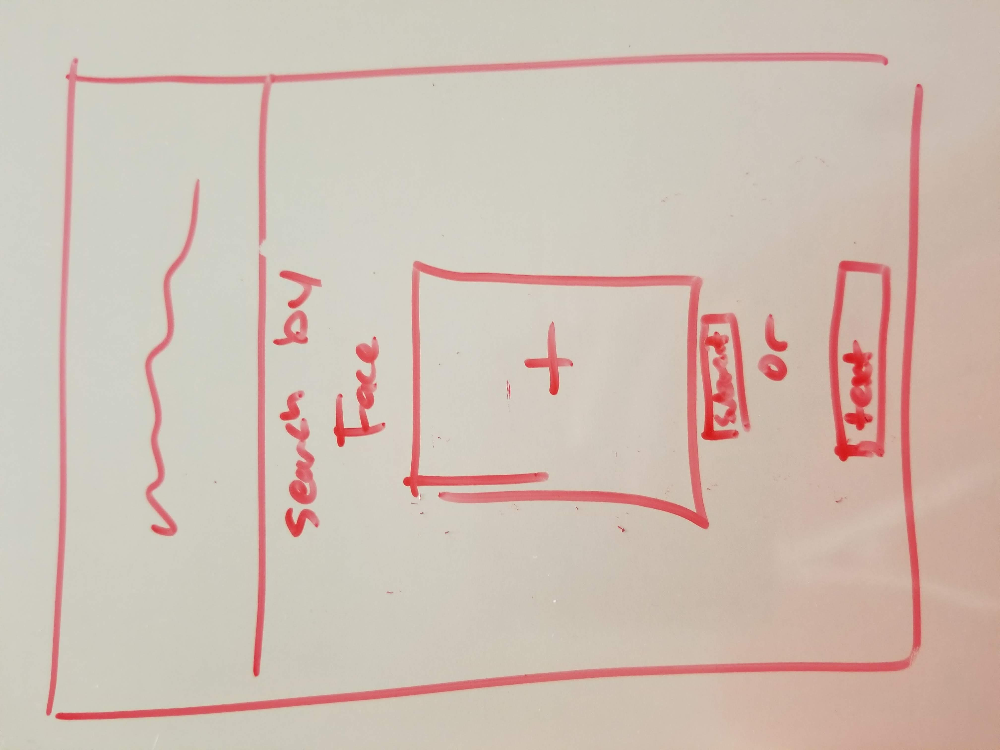
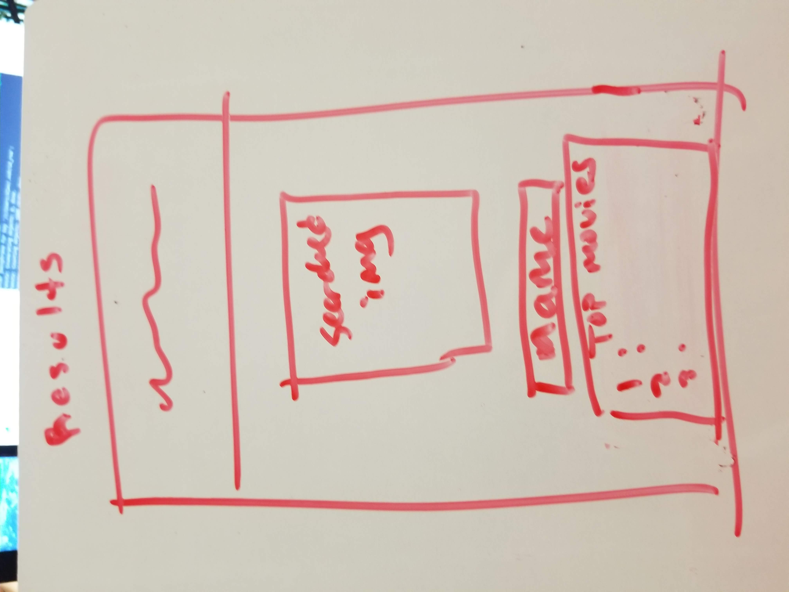

# group5TuesThurs

#Project Title
who dat is?

#Description
A facial recognition web app that allows users to upload a picture of an actor in a movie they are watching, and recieve the name of the actor and other movies they have been in.

#Initial Designs

#Team Members & Roles
Alex: API Integration
Par: Front End
Savannah: Front End
Michael: Back End

#Technologies Used
Sightengine API
OMDB API

#Breakdown of Tasks/Schedule
By Tuesday: Front-End Skeleton